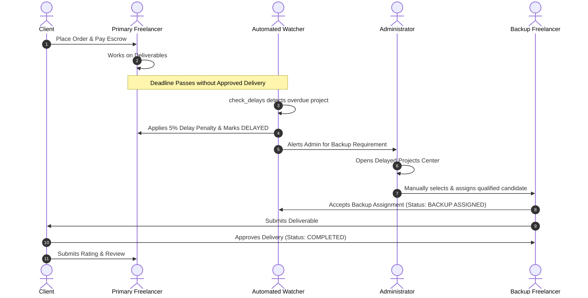

# HIREVO – AI-Powered Freelance Services Marketplace with Smart Project Management

[](https://www.python.org/)
[](https://www.djangoproject.com/)
[](https://getbootstrap.com/)
[](https://opensource.org/licenses/MIT)

**Hirevo** is an original full-stack freelance services marketplace inspired by modern service workflows, augmented with **explainable AI talent recommendation** and an **intelligent project continuity management engine** (dynamic deadline monitoring, automatic delay detection, automated freelancer penalties, and administrator-controlled backup freelancer assignments).

---

## Table of Contents

1. [Executive Summary & Problem Solved](#executive-summary--problem-solved)
2. [Key Differentiators & Smart Features](#key-differentiators--smart-features)
3. [User Roles & Capabilities](#user-roles--capabilities)
4. [Technology Stack](#technology-stack)
5. [System Architecture & Database Design](#system-architecture--database-design)
6. [Explainable AI Recommendation Engine](#explainable-ai-recommendation-engine)
7. [Smart Delay Detection & Backup Assignment Workflow](#smart-delay-detection--backup-assignment-workflow)
8. [Installation & Setup](#installation--setup)
9. [Running the Application](#running-the-application)
10. [Step-by-Step Demonstration Scenario](#step-by-step-demonstration-scenario)
11. [Email Delivery and Account Verification](#email-delivery-and-account-verification)
12. [Running Automated Tests](#running-automated-tests)
13. [REST API Documentation](#rest-api-documentation)
14. [Production Deployment Guide](#production-deployment-guide)

---

## 1. Executive Summary & Problem Solved

Standard freelance marketplaces allow clients to hire freelancers, but suffer from significant project delivery risks when freelancers miss deadlines or abandon projects. 

**Hirevo resolves this critical vulnerability by combining a Fiverr-style marketplace with an intelligent project continuity engine:**
- **Automated Deadline Watcher**: Continuously tracks active delivery deadlines.
- **Fair Delay Penalty**: Primary freelancers missing deadlines automatically receive a 5% delay penalty on their order amount.
- **Administrator-Controlled Backup Assignment**: Platform management is immediately notified and assigns a vetted, skill-matched backup freelancer to continue the project without restarting from scratch.
- **Complete Audit Trail**: Immutable Project History records every milestone from order placement, simulated escrow payment, revision logs, delay flags, and backup transitions to final approval.

---

## 2. Key Differentiators & Smart Features

| Feature | Description |
|---|---|
| **Marketplace Catalog & 3-Tier Packages** | Freelancers publish gigs with Basic, Standard, and Premium packages with custom pricing, delivery days, revisions, and feature bullets. |
| **Explainable AI Matching** | Multi-factor weighted scoring model (Skill overlap 40%, NLP TF-IDF cosine relevance 15%, Experience 15%, Rating 15%, Availability 10%, Budget fit 5%) displaying transparent score breakdown bars on `/recommendations/`. |
| **Simulated Escrow Gateway** | Safe simulated payment simulation (`HV-PAY-YYYY-XXXXX`) locking funds until client approves deliverables. |
| **Dynamic Deadline Tracking** | Automated date-time calculation stored at the database level on order placement. |
| **Automatic Delay Detection** | `python manage.py check_delays` command & admin dashboard trigger identifying overdue orders and marking them as `Delayed`. |
| **5% Delay Penalty** | Automatic penalty calculation applied to primary freelancers on missed deadlines, preventing duplicate deductions. |
| **Administrator Backup Flow** | Vetted candidate ranking enabling administrators to assign qualified backup freelancers to overdue projects. |
| **Project History Timeline** | Visual chronological audit trail attached to every order. |
| **Direct Messaging & Notifications** | Database-driven real-time notifications with unread counts and 1-on-1 thread messaging. |

---

## 3. User Roles & Capabilities

### 1. Client
- Register, login, manage profile (bio, location, avatar).
- Browse marketplace catalog, filter by category, price, rating, and delivery time.
- Explore AI Recommendations with custom project requirements.
- Select gig package tier and submit detailed project scope and attachment.
- Make simulated escrow payments (`HV-PAY-YYYY-XXXXX`).
- Review submitted deliverables, request revisions (within package limits), and approve completions.
- Rate freelancers (1–5 stars) and write reviews (duplicate prevention enforced).
- View full transaction history and project timelines.

### 2. Freelancer
- Register, login, manage professional profile (bio, skills multi-select, experience years, hourly rate, availability status, education, languages).
- Manage portfolio items (screenshots, descriptions, live project links).
- Manage certificates with document upload.
- Create, edit, and toggle service gigs with 3-tier pricing (Basic, Standard, Premium).
- Accept or reject incoming client orders.
- Submit work deliverables with release notes and file attachments.
- Handle client revision requests and resubmit work.
- Receive backup project assignments from administrators and Accept/Decline continuity management.
- Monitor gross earnings, in-escrow pending funds, and delay deductions ledger.

### 3. Administrator (Staff Superuser)
- Access protected operations dashboard (`/admin-dashboard/`).
- Monitor global platform metrics (Users, Gigs, Orders, Escrow Volume, Penalties, Backups).
- Search and moderate user accounts with 1-click Activate/Deactivate.
- Moderate marketplace gigs and categories.
- Monitor active, completed, and overdue projects.
- **Delayed Projects Operations**: Review overdue orders and manually select & assign qualified backup freelancers based on ranked compatibility.
- View and manage penalty logs and backup assignments audit trails.
- Moderate reviews and payments.

---

## 4. Technology Stack

- **Backend**: Python 3.10+, Django 5.1+
- **Database**: SQLite (local development) / PostgreSQL ready (production)
- **AI & NLP**: Scikit-learn (TF-IDF Vectorizer & Cosine Similarity) + Deterministic multi-factor scoring
- **REST APIs**: Django REST Framework (DRF)
- **Frontend**: HTML5, CSS3, JavaScript, Bootstrap 5.3, Bootstrap Icons, Google Fonts (Inter & Outfit)
- **File Handling**: Pillow, Django File Uploads / Media Root
- **Security**: Django PBKDF2 Password Hashing, CSRF protection, Role-based view decorators & DRF permission classes
- **Production Server**: Gunicorn, WhiteNoise compressed static file handling

---

## 5. System Architecture & Database Design

```
Hirevo/
├── manage.py
├── requirements.txt
├── README.md
├── .env.example
├── .gitignore
│
├── hirevo/
│   ├── settings.py
│   ├── urls.py
│   ├── asgi.py
│   └── wsgi.py
│
├── marketplace/
│   ├── models.py              # 16 Database Models
│   ├── views.py               # Complete Multi-role Views & Error Handlers
│   ├── forms.py               # Bootstrap 5 Styled Forms
│   ├── urls.py                # Public, Client, Freelancer, Admin & API routes
│   ├── services.py            # Delay Detection, History, Penalties, Notifications
│   ├── ai_recommendation.py   # TF-IDF + Weighted Explainable Matching Engine
│   ├── permissions.py         # Client, Freelancer & Admin Decorators
│   ├── serializers.py         # Django REST Framework Serializers
│   ├── api_views.py           # REST API Endpoints
│   ├── admin.py               # Rich Django Admin Registration
│   ├── context_processors.py  # Navigation categories & Unread notification counters
│   ├── tests.py               # Comprehensive Automated Test Suite
│   │
│   ├── management/
│   │   └── commands/
│   │       ├── check_delays.py # Automatic Delay Detection Watcher
│   │       └── seed_data.py    # Seed Categories & Skills
│   │
│   ├── static/
│   │   └── css/custom.css     # Hirevo Modern UI Theme
│   │
│   └── templates/
│       ├── base.html
│       ├── home.html
│       ├── accounts/          # Login, Register, Password Reset
│       ├── gigs/              # Catalog, Gig Details, Order Confirmation
│       ├── recommendations/   # AI Matcher with Explainability Bars
│       ├── client/            # Client Portal & Payment Simulation
│       ├── freelancer/        # Freelancer Portal & Gigs/Portfolio/Earnings
│       ├── administrator/     # Admin Dashboard, Delay Center, Backup Assignment
│       ├── messages/          # 1-on-1 Direct Chat System
│       ├── notifications/     # Notifications Center
│       └── errors/            # Custom 404, 403, 500 Pages
│
└── media/                     # User Profile, Gigs, Deliveries & Portfolio Uploads
```

---

## 6. Explainable AI Recommendation Engine

The AI matching engine (`marketplace/ai_recommendation.py`) computes transparent scores from actual database attributes:

$$\text{Final Score} = 0.40(\text{Skill Overlap}) + 0.15(\text{NLP Semantic Relevance}) + 0.15(\text{Experience}) + 0.15(\text{Rating}) + 0.10(\text{Availability}) + 0.05(\text{Budget Fit})$$

1. **Skill Overlap (40%)**: Ratio of required skills present in freelancer skillset.
2. **NLP Text Match (15%)**: Cosine similarity of TF-IDF vectors between project scope and freelancer bio/title corpus.
3. **Experience (15%)**: Normalized score based on verified years of experience.
4. **Reputation (15%)**: 1–5 star rating normalized to a percentage.
5. **Availability (10%)**: Available (100%), Busy (50%), Unavailable (10%).
6. **Budget Fit (5%)**: Ratio of candidate hourly rate versus target budget.

---

## 7. Smart Delay Detection & Backup Assignment Workflow



---

## 8. Installation & Setup

### Prerequisites
- Python 3.10+
- Git

### Step 1: Clone Repository & Open Workspace
```powershell
cd d:\Project\Hirevo\Hirevo
```

### Step 2: Create & Activate Virtual Environment
```powershell
python -m venv venv
# On Windows:
.\venv\Scripts\activate
# On Linux/macOS:
source venv/bin/activate
```

### Step 3: Install Dependencies
```powershell
pip install -r requirements.txt
```

### Step 4: Configure Environment Variables
Copy `.env.example` to `.env`:
```powershell
cp .env.example .env
```
Default `.env` configuration for local SQLite development:
```ini
SECRET_KEY=hirevo-production-secret-key-change-in-production
DEBUG=True
DB_ENGINE=django.db.backends.sqlite3
DB_NAME=db.sqlite3
```

### Step 5: Run Database Migrations
```powershell
python manage.py makemigrations
python manage.py migrate
```

### Step 6: Seed Initial Marketplace Categories & Skills
```powershell
python manage.py seed_data
```

### Step 7: Create Administrator Account
```powershell
python manage.py createsuperuser
```
Follow prompts to enter your administrator username, email, and secure password.

---

## 9. Running the Application

Start the Django development server:
```powershell
python manage.py runserver
```
Access the application in your browser: **`http://127.0.0.1:8000/`**

---

## 10. Step-by-Step Demonstration Scenario

### Part 1: Standard Marketplace Flow
1. **Register Freelancer**: Go to `http://127.0.0.1:8000/register/`, select **Freelancer**, enter details, and sign up.
2. **Setup Freelancer Profile & Gigs**: Open **Profile Settings** to add skills (e.g. Python, Django, Web Development). Then go to **Create New Gig** to publish a gig with Basic (₹500), Standard (₹1500), and Premium (₹3000) packages.
3. **Logout & Register Client**: Logout, go to `/register/`, select **Client**, and register.
4. **Discover & AI Match**: Browse `/gigs/` or go to `/recommendations/` to test the explainable AI matcher by entering required skills.
5. **Place Order**: Open the freelancer's gig, choose **Basic Package**, click **Order Now**, submit project requirements, and complete the **Simulated Escrow Payment**.
6. **Accept & Deliver**: Log in as the freelancer, accept the order, and submit a deliverable file with release notes.
7. **Approve & Review**: Log in as the client, inspect deliverables, click **Approve & Complete Project**, and submit a 5-star review.

### Part 2: Smart Delay Detection & Backup Assignment Demonstration
1. Create a simulated order or update an order deadline to a past date.
2. Run the automatic delay detection command:
   ```powershell
   python manage.py check_delays
   ```
3. Observe output: Order is marked as **`DELAYED`**, a **5% penalty** is recorded on the primary freelancer, and notifications are dispatched.
4. **Administrator Assignment**: Log in as Administrator, navigate to **`/admin-dashboard/delayed/`**, click **Assign Backup**, review ranked candidate matches, select a backup freelancer, and click **Assign Backup Freelancer**.
5. **Backup Specialist Resumes Work**: Log in as the assigned backup freelancer, open **Backup Assignments**, click **Accept Assignment**, and open the project workspace to complete the delivery.
6. Inspect the **Project History Timeline** on the order detail page to review the complete immutable audit trail.

---

## 11. Email Delivery and Account Verification

Registration for both clients and freelancers is completed only after the user enters the six-digit OTP sent to their email address. Configure SMTP in your local `.env` before starting the application so these OTPs and project notifications are delivered:

```env
EMAIL_BACKEND=django.core.mail.backends.smtp.EmailBackend
EMAIL_HOST=smtp.gmail.com
EMAIL_PORT=587
EMAIL_USE_TLS=True
EMAIL_HOST_USER=your-sending-address@example.com
EMAIL_HOST_PASSWORD=your-provider-app-password
DEFAULT_FROM_EMAIL=Hirevo Platform <your-sending-address@example.com>
SITE_URL=http://127.0.0.1:8000
```

For a scheduled deadline sweep in production, run `python manage.py check_delays` on a recurring scheduler (for example, every 15 minutes). It marks overdue active orders as delayed and sends one email each to the client and assigned freelancer.

## 12. Running Automated Tests

Run the full automated test suite verifying permissions, security, order lifecycles, delay penalties, AI recommendations, backup workflows, and REST APIs:

```powershell
python manage.py test marketplace
```

---

## 13. REST API Documentation

Hirevo includes a clean Django REST Framework API for headless and mobile integration:

| Method | Endpoint | Description | Permission |
|---|---|---|---|
| `GET` | `/api/categories/` | List all active marketplace categories | Public |
| `GET` | `/api/gigs/` | Search & filter active service gigs (`?q=`, `?category=`) | Public |
| `GET` | `/api/gigs/<id>/` | Retrieve detailed gig specifications & pricing tiers | Public |
| `GET` | `/api/freelancers/` | List vetted freelancers with rating and skill filters | Public |
| `GET` | `/api/freelancers/<user_id>/` | Retrieve freelancer profile and stats | Public |
| `GET` | `/api/orders/` | List orders for authenticated user | Authenticated |
| `GET` | `/api/recommendations/` | Multi-factor AI recommendation engine (`?title=`, `?skills=`, `?budget=`) | Public |

---

## 14. Production Deployment Guide

### Environment Configuration (.env)
```ini
SECRET_KEY=your-strong-production-secret-key
DEBUG=False
ALLOWED_HOSTS=yourdomain.com,www.yourdomain.com

# PostgreSQL Configuration
DB_ENGINE=django.db.backends.postgresql
DB_NAME=hirevo_db
DB_USER=hirevo_user
DB_PASSWORD=your_secure_password
DB_HOST=localhost
DB_PORT=5432
```

### Static Files & Gunicorn Execution
```powershell
python manage.py collectstatic --noinput
gunicorn hirevo.wsgi:application --bind 0.0.0.0:8000 --workers 3
```

---

## License

This project is licensed under the MIT License. Developed for advanced freelance marketplace operations with smart project management.
